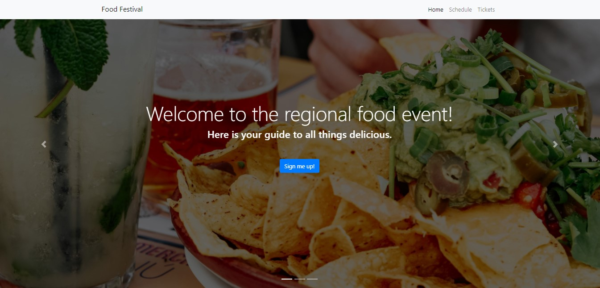

# Food Festival

### Description
This front-end progressive web application (P.W.A.) uses service workers to cache assets for offline functionality. Utilizes lazy loading. Uses webpack dependency graphs to keep track of needed bundles for each entry point. All this is in place to create an efficient and responsive web application.

### License

This application is licensed under MIT

### Application Demo

### Table of Contents
- [Description](#description)
- [Contributing](#contributing)
- [Tests](#tests)
- [Questions?](#questions)

### Contributing
No contributions at this time.

### Tests
N/A

### Questions
GitHub Username: (kcaseychamberlain) 

View the project in GitHub at: https://github.com/KCaseyChamberlain/food-festival

View the application live hosted at: https://kcaseychamberlain.github.io/food-festival/
    
If you have any questions, contact Casey at: caseygchamberlain@gmail.com
